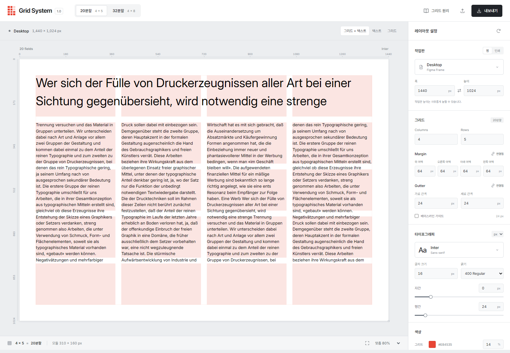
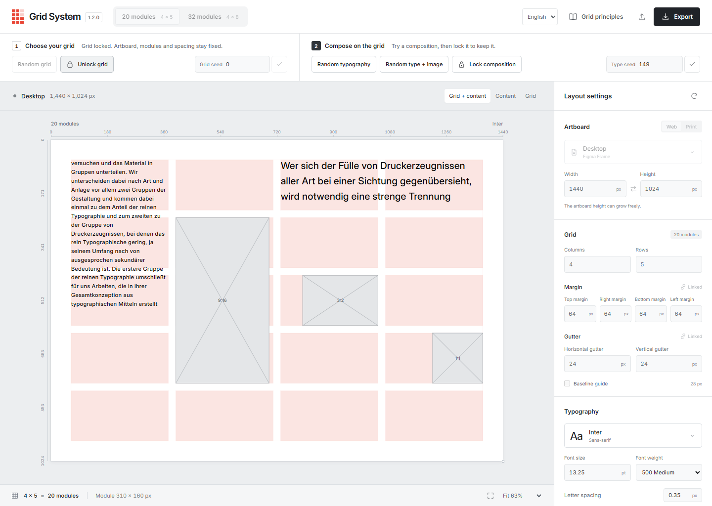
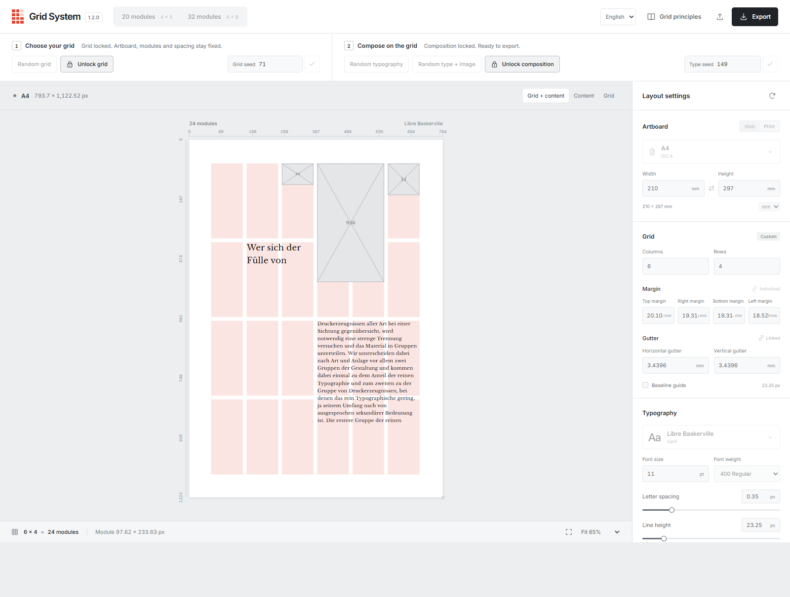
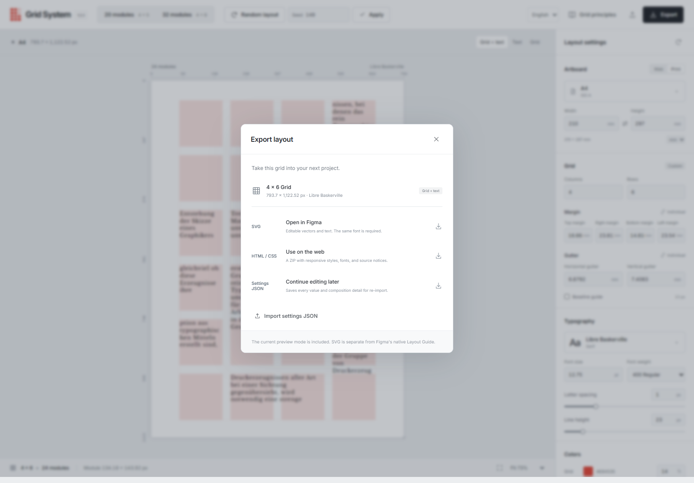

<div align="center">

# Grid System

**grid-based layout experiments for web and print**

Find a grid, lock it, then explore typography and image placeholders on top.  
Take the result into Figma or your next web project with SVG, HTML/CSS, and JSON exports.

**[▶ Live demo — grid-system.pages.dev](https://grid-system.pages.dev/)**

[English](#what-is-grid-system) · [한국어](#한국어) · [MIT License](LICENSE) · v1.2.0

</div>

---



## What is Grid System?

Grid System is a browser-based layout tool for designers working across screens and paper.
Choose an artboard, tune its columns, rows, margins, and gutters, and see real text arranged
on the grid. Start with the default 20-module layout, or generate a grid you like, lock it,
and explore typography and proportional image boxes without losing that structure.

Inspired by Josef Müller-Brockmann's approach to order, proportion, and typographic rhythm,
the project explores how classical grid thinking can support contemporary work rather than
reproducing pages from his book. The preview uses actual font measurements, separate random
seeds for grid and composition, and reusable exports: editable SVG, an offline HTML/CSS
package, and settings JSON.

## Screenshots

| Typography + image boxes | A4 · Libre Baskerville | Export for design and development |
| --- | --- | --- |
| [](docs/screenshots/grid-system-composition.png) | [](docs/screenshots/grid-system-print.png) | [](docs/screenshots/grid-system-export.png) |

Actual application captures in Chrome at **1440 × 1024**. The gray rectangles are image
placeholders, not photographs. Click a thumbnail to view it at full size.

## Features

- **20 or 32 modules** — start with **4 × 5** by default or switch to **4 × 8**.
  Custom columns, rows, margins, and horizontal/vertical gutters recalculate the module count and dimensions.
- **60 artboard presets** — Figma Frame-based phone, tablet, and desktop sizes, including the
  default **Desktop 1440 × 1024 px**; ISO A, ISO B, JIS B, Korean paper cuts and finished formats,
  and US Letter, Legal, Tabloid, Ledger, Statement, and Executive.
- **Two-stage exploration** — generate and lock the grid first, then generate typography
  or typography + image boxes. Grid and type have separate seeds and locks.
- **Compositions across the whole grid** — headings and body text can begin in different
  cells, including the middle or bottom of the page. Random generation considers measured
  text width and usable paragraph space instead of relying on a few fixed top-aligned templates.
- **Nine image ratios** — choose a pool from **1:1, 2:3, 4:5, 5:7, 5:8, 16:9, 3:2, 4:3,
  and 9:16**. Boxes retain their proportions inside reserved grid areas.
- **12 typefaces** — Inter, Libre Baskerville, EB Garamond, Cormorant, Montserrat, Lato,
  Oswald, Outfit, Pretendard, Wanted Sans, 열린명조, and 열린고딕. Fonts are self-hosted
  and loaded on selection; available weights follow each family's actual assets.
- **Point-based type size** — **pt only**, with a **12 pt** default and a **4.5–90 pt** range
  in **0.25 pt** steps. Letter spacing and leading remain in px.
- **Density experiments** — adjust paragraph fill, tracking, and leading. Manual leading
  can go down to **1 px**: overlapping glyphs remain visible and exportable, with a warning.
- **Independent color and opacity** — style grid guides and text separately, and switch
  between grid + content, content only, or grid only.
- **Three reusable exports** — SVG with editable text and vector boxes; an HTML/CSS ZIP
  with the selected fonts and notices; and settings JSON with both seeds, locks, and ratio choices.
- **English and Korean** — English is the default UI language. Settings stay in the current
  browser; the supplied German sample text is preserved and repeated regardless of UI language.

## Controls

Use the top workflow bar to explore and lock each stage; use the right-hand inspector for precise values.

| Input | Result |
| --- | --- |
| Artboard preset / width / height | Set the working format before locking the grid |
| 20 modules / 32 modules | Apply the 4 × 5 or 4 × 8 grid shortcut |
| Random grid / Apply grid seed | Generate columns, rows, margins, and gutters; show the empty grid |
| Lock grid | Freeze the artboard and grid geometry, then enable content generation |
| Random typography | Generate text placement, size, weight, tracking, leading, and fill on the locked grid |
| Random type + image | Generate typography together with proportional placeholder boxes |
| Apply type seed | Reproduce the current content mode without changing the grid |
| Image ratio checkboxes | Choose which of the nine ratios can appear |
| Lock composition | Freeze typography, text styling, ratios, and content randomization |
| Inspector fields and sliders | Fine-tune the unlocked stage; direct input is not limited to the random generator's preferred ranges |
| Grid + content / Content / Grid | Change visible layers in the preview and visual exports |
| Export / Import settings | Download SVG, HTML/CSS ZIP, or JSON; restore a saved settings JSON |

You can lock the default or a manually edited grid without generating one first. Unlocking
only the composition keeps the grid fixed; unlocking the grid also releases the composition
lock. Generating a new grid clears its generated content but keeps the current artboard and type settings.

## How the grid becomes a layout

For `C` columns, `R` rows, and an artboard of width `W` and height `H`:

```text
module count  = C × R
module width  = (W − left margin − right margin − (C − 1) × horizontal gutter) / C
module height = (H − top margin − bottom margin − (R − 1) × vertical gutter) / R
```

| Principle | Implementation |
| --- | --- |
| Structure before content | The grid seed controls geometry; the type seed controls composition on that geometry |
| Measured text | Layout waits for the selected font, then uses its metrics to wrap text and evaluate usable space |
| Room to read | Random compositions seek readable body widths and space for at least three lines; manual extremes remain available |
| Proportion without distortion | Image boxes fit their reserved areas at the selected ratio; text and image reservations do not overlap |
| Reproducible state | Reuse the same seeds and inputs, or save JSON to retain all settings after manual edits |
| Continuous sample | The supplied German text repeats when more content is needed; changing UI language does not translate it |
| Safe failure | Invalid geometry keeps the last valid preview and shows guidance; total generated text is capped at 10,000 lines |

Geometry is calculated in CSS px. Print presets retain their physical page size, and print
dimensions can be entered in mm or px. Type size uses the CSS conversion **1 pt = 4/3 px**
(**12 pt = 16 px**). Preview zoom changes the view, not the underlying layout.

## Tech stack

- [React 19](https://react.dev/) + [TypeScript 7](https://www.typescriptlang.org/) — editor state and typed layout data.
- [Vite 8](https://vite.dev/) — local development and static production builds.
- SVG + browser font measurement — preview, typography placement, and editable vector export.
- [fflate](https://github.com/101arrowz/fflate) — offline HTML/CSS ZIP packaging in the browser.
- [Vitest](https://vitest.dev/) + [Playwright](https://playwright.dev/) — layout logic, workflow, and export tests.
- [Cloudflare Pages](https://developers.cloudflare.com/pages/) — production hosting with Git integration.

Font assets live in [public/fonts](public/fonts), with their source and license notices in
[public/font-notices](public/font-notices). See [FONTS.md](FONTS.md) for sources and supported weights.
The supplied sample is preserved in [src/sample.txt](src/sample.txt).

## Project structure

```text
src/
├── App.tsx            # Editor state, inspector, preview, import/export
├── WorkflowBar.tsx    # Grid → composition stages, seeds, and locks
├── core.ts            # Geometry, seeded generation, text layout
├── model.ts           # Settings, validation, migration, and persistence
├── export.ts          # SVG, HTML/CSS ZIP, and settings JSON
├── fonts.ts           # Typeface catalog, loading, and metrics
├── presets.ts         # Web and print artboard presets
├── i18n.ts            # English and Korean UI copy
├── sample.txt         # Supplied German sample
└── styles.css         # Editor layout and presentation
public/
├── fonts/             # Self-hosted WOFF2 assets
└── font-notices/      # Preserved third-party font notices
tests/                 # Playwright browser tests
scripts/               # Font checks, screenshot capture, Pages helper
docs/screenshots/      # Real application captures used here
```

React owns the active settings and last valid preview. Layout generation and exporters consume
explicit settings; local browser storage and JSON preserve the reproducible editing state.

## Getting started

Use **Node.js 22.12 or newer**. Development and Pages are pinned to **22.15.0** via
`.node-version` and the deployment environment.

```bash
git clone https://github.com/dostevskii/grid-system.git
cd grid-system
npm ci
npm run dev          # http://127.0.0.1:5173
npm run build        # typecheck + production output in dist/
npm run preview      # inspect the production build locally
npm test             # Vitest
npm run test:e2e     # Playwright; requires local Google Chrome
```

Deploy with Cloudflare Pages Git integration:

| Setting | Value |
| --- | --- |
| Production branch | `main` |
| Build command | `npm run build` |
| Output directory | `dist` |
| `NODE_VERSION` | `22.15.0` |
| Production URL | [grid-system.pages.dev](https://grid-system.pages.dev/) |

The existing Pages project deploys automatically on a push to `main`. For its PowerShell
helper, provide `CLOUDFLARE_API_TOKEN` and `CLOUDFLARE_ACCOUNT_ID` through your environment,
never as committed values:

```powershell
.\scripts\deploy-pages.ps1          # Read project and deployment status
.\scripts\deploy-pages.ps1 -Deploy  # Redeploy the connected main branch
```

The `private: true` field in `package.json` prevents accidental npm publication; it does
not control this GitHub repository's visibility. Run `node scripts/capture-readme.mjs` to
recapture these screenshots from the live app, or set `GRID_SYSTEM_BASE_URL` to a local build.
See [VERIFICATION.md](VERIFICATION.md) for recorded checks and [CHANGELOG.md](CHANGELOG.md)
for version history.

## Design

The project draws on Josef Müller-Brockmann's grid principles: shared alignment, deliberate
margins, a modular structure, and typographic rhythm. It is an independent interpretation,
not a reproduction of the book's plates or an affiliated product.

The interface is implemented directly in React and SVG. Figma is an export destination and
the reference for web frame presets; this repository does not include a separate Figma design file.
The reference book PDF is not included in the source or deployment.
[PLAN.md](PLAN.md) records the original product plan, [PRESETS.md](PRESETS.md) documents
artboard references, and [FONTS.md](FONTS.md) covers the type catalog.

## Known limitations

- This is a generated layout explorer, not a drag-and-drop page editor or a native Figma Layout Guide plugin.
- Images are ratio boxes only. There is no photo library or image upload.
- Very small artboards or extreme manual grids may not leave usable paragraph space.
  Intentionally short leading can overlap text; that is a supported experiment, not an automatic correction.
- SVG keeps text editable and requires the appropriate fonts in the receiving application.
  Outlined type, PDF export, CMYK, bleed, and crop marks are not provided; verify physical printing separately.
- Browser settings are local, not cloud-synced. Use JSON to move or archive a composition.

## License

Grid System's original source code and documentation are licensed under the
[MIT License](LICENSE). Copyright © 2026 FRAMEWORKS.

Third-party assets are excluded from this MIT grant. The [font files](public/fonts)
retain their [existing notices](public/font-notices): ten typefaces include OFL notices,
and the two Yeolrin families have a separate source/usage notice.
The supplied [German sample text](src/sample.txt) retains its original rights;
this project does not grant additional permission to reuse that text.

---

# 한국어

[English로 돌아가기](#what-is-grid-system) · [라이브 데모 열기](https://grid-system.pages.dev/)

## Grid System이란?

Grid System은 웹과 인쇄물을 함께 다루는 디자이너를 위한 브라우저 기반 레이아웃 도구입니다.
작업판을 고르고 컬럼·행·여백·거터를 조절하면 실제 텍스트가 그리드 위에 배치됩니다.
기본 20분할에서 시작하거나 마음에 드는 그리드를 생성해 잠근 뒤,
그 구조를 유지한 채 타이포그래피와 비율 고정 이미지 박스를 탐색할 수 있습니다.

Josef Müller-Brockmann의 질서·비례·타이포그래피 리듬에서 출발해, 책의 판면을 복제하기보다
고전적인 그리드 사고를 오늘의 작업에 활용하는 방법을 실험합니다. 실제 폰트 측정값으로
미리보기를 구성하고, 그리드와 콘텐츠에 별도 랜덤 시드를 사용합니다.
결과는 편집 가능한 SVG, 오프라인 HTML/CSS 패키지, 설정 JSON으로 가져갈 수 있습니다.

## 스크린샷

| 타이포 + 이미지 박스 | A4 · Libre Baskerville | 디자인과 개발을 위한 내보내기 |
| --- | --- | --- |
| [](docs/screenshots/grid-system-composition.png) | [](docs/screenshots/grid-system-print.png) | [](docs/screenshots/grid-system-export.png) |

Chrome **1440 × 1024**에서 직접 촬영한 실제 앱 화면입니다.
회색 사각형은 사진이 아닌 이미지 자리표시자입니다. 작은 이미지를 클릭하면 원본을 볼 수 있습니다.

## 주요 기능

- **20분할 또는 32분할** — 기본 **4 × 5**에서 시작하거나 **4 × 8**로 전환합니다.
  컬럼·행·여백·가로/세로 거터를 직접 조절하면 분할 수와 모듈 치수를 다시 계산합니다.
- **60개 작업판 프리셋** — Figma Frame 기반 Phone·Tablet·Desktop과 기본
  **Desktop 1440 × 1024 px**, ISO A·ISO B·JIS B, 국내 국절과 완성 판형,
  미국 Letter·Legal·Tabloid·Ledger·Statement·Executive를 제공합니다.
- **두 단계 탐색** — 먼저 그리드를 생성하고 잠근 뒤 타이포 또는 타이포 + 이미지 박스를 생성합니다.
  그리드와 타이포는 각각 별도 시드와 잠금을 사용합니다.
- **그리드 전체를 쓰는 배치** — 제목과 본문은 서로 다른 셀, 중앙, 하단에서도 시작할 수 있습니다.
  몇 가지 상단 정렬 템플릿에만 의존하지 않고 실제 글자 폭과 문단 공간을 고려해 생성합니다.
- **이미지 비율 9종** — **1:1, 2:3, 4:5, 5:7, 5:8, 16:9, 3:2, 4:3, 9:16** 중
  생성에 사용할 비율을 고릅니다. 박스는 예약된 그리드 영역 안에서 비율을 유지합니다.
- **서체 12종** — Inter, Libre Baskerville, EB Garamond, Cormorant, Montserrat, Lato,
  Oswald, Outfit, Pretendard, Wanted Sans, 열린명조, 열린고딕.
  폰트는 자체 호스팅하고 선택 시 불러오며, 실제 자산이 지원하는 굵기를 제공합니다.
- **pt 전용 글자 크기** — 기본 **12 pt**, 범위 **4.5–90 pt**, 간격 **0.25 pt**입니다.
  글자 크기에 px 선택지는 없으며, 자간과 행간은 px를 유지합니다.
- **밀도 실험** — 문단 채우기·자간·행간을 조절합니다. 수동 행간은 **1 px**까지 내려갈 수 있으며,
  글리프가 겹쳐도 경고와 함께 화면과 내보내기에 그대로 표현합니다.
- **독립적인 색상과 불투명도** — 그리드 가이드와 텍스트를 따로 설정하고,
  그리드 + 콘텐츠 / 콘텐츠만 / 그리드만 보기로 전환합니다.
- **재사용 가능한 내보내기 3종** — 편집 가능한 텍스트·벡터 박스의 SVG,
  선택한 폰트와 고지문을 포함한 HTML/CSS ZIP, 두 시드·잠금·비율 선택을 보관하는 설정 JSON.
- **영어와 한국어** — 기본 UI 언어는 영어입니다. 설정은 현재 브라우저에 보관하고,
  제공받은 독일어 샘플은 UI 언어와 관계없이 원문을 유지해 반복 사용합니다.

## 조작 방법

상단 작업 막대에서 각 단계를 탐색하고 잠근 뒤, 오른쪽 설정 패널에서 세부 수치를 조절합니다.

| 조작 | 동작 |
| --- | --- |
| 작업판 프리셋 / 폭 / 높이 | 그리드를 잠그기 전에 작업 규격 설정 |
| 20분할 / 32분할 | 4 × 5 또는 4 × 8 그리드 바로 적용 |
| 랜덤 그리드 / 그리드 시드 적용 | 컬럼·행·여백·거터를 생성하고 빈 그리드 표시 |
| 그리드 잠금 | 작업판과 그리드 치수를 고정하고 콘텐츠 생성 활성화 |
| 랜덤 타이포 | 잠근 그리드 위에서 텍스트 위치·크기·굵기·자간·행간·채우기 생성 |
| 랜덤 타이포 + 이미지 | 타이포와 비율 고정 자리표시자 박스를 함께 생성 |
| 타이포 시드 적용 | 그리드를 바꾸지 않고 현재 콘텐츠 종류를 재현 |
| 이미지 비율 체크박스 | 9종 중 생성에 사용할 비율 선택 |
| 구성 잠금 | 타이포·텍스트 스타일·비율·콘텐츠 랜덤 생성 고정 |
| 설정 패널의 입력칸과 슬라이더 | 잠금 해제된 단계 정밀 조절. 수동 입력은 랜덤 생성의 권장 범위에 제한되지 않음 |
| 그리드 + 콘텐츠 / 콘텐츠 / 그리드 | 미리보기와 시각 내보내기의 표시 레이어 변경 |
| 내보내기 / 설정 가져오기 | SVG·HTML/CSS ZIP·JSON 다운로드 또는 저장한 JSON 복원 |

기본 그리드나 직접 조절한 그리드도 바로 잠글 수 있습니다. 구성만 잠금 해제하면 그리드는 유지되고,
그리드를 잠금 해제하면 구성 잠금도 함께 풀립니다. 새 그리드를 생성하면 생성된 콘텐츠는 비워지지만
현재 작업판과 타이포 설정은 유지합니다.

## 그리드가 레이아웃이 되는 방식

컬럼 수 `C`, 행 수 `R`, 작업판 폭 `W`, 높이 `H`를 기준으로 계산합니다.

```text
분할 수   = C × R
모듈 폭   = (W − 왼쪽 여백 − 오른쪽 여백 − (C − 1) × 가로 거터) / C
모듈 높이 = (H − 위쪽 여백 − 아래쪽 여백 − (R − 1) × 세로 거터) / R
```

| 원칙 | 구현 |
| --- | --- |
| 콘텐츠보다 구조 먼저 | 그리드 시드는 치수를, 타이포 시드는 그 구조 위의 구성을 제어 |
| 실제 텍스트 측정 | 선택한 폰트가 로드된 뒤 측정값으로 줄을 나누고 사용 가능한 공간 평가 |
| 읽을 공간 확보 | 랜덤 구성은 읽을 수 있는 본문 폭과 최소 세 줄의 공간을 탐색. 수동 극단값은 별도 허용 |
| 왜곡 없는 비율 | 이미지 박스는 예약 영역 안에서 선택한 비율을 유지. 텍스트와 이미지 예약 영역은 겹치지 않음 |
| 재현 가능한 상태 | 같은 시드와 입력값을 재사용하거나 JSON으로 수동 변경까지 포함한 설정 보관 |
| 연속되는 샘플 | 필요한 길이만큼 제공된 독일어 원문을 반복. UI 언어 변경으로 번역하지 않음 |
| 안전한 오류 처리 | 잘못된 치수에서는 마지막 유효 미리보기와 조정 안내를 표시. 전체 생성 텍스트는 최대 10,000행 |

치수는 내부적으로 CSS px로 계산합니다. 인쇄 프리셋은 실제 용지 크기를 보존하며,
인쇄용 치수는 mm 또는 px로 입력할 수 있습니다. 글자 크기는 CSS 기준
**1 pt = 4/3 px**(**12 pt = 16 px**)로 변환합니다.
미리보기 확대·축소는 화면 배율만 바꾸고 실제 레이아웃 크기는 바꾸지 않습니다.

## 기술 구성

- [React 19](https://react.dev/) + [TypeScript 7](https://www.typescriptlang.org/) — 편집 상태와 타입이 정의된 레이아웃 데이터.
- [Vite 8](https://vite.dev/) — 로컬 개발과 정적 프로덕션 빌드.
- SVG + 브라우저 폰트 측정 — 미리보기, 타이포 배치, 편집 가능한 벡터 내보내기.
- [fflate](https://github.com/101arrowz/fflate) — 브라우저에서 오프라인 HTML/CSS ZIP 생성.
- [Vitest](https://vitest.dev/) + [Playwright](https://playwright.dev/) — 레이아웃 로직, 작업 흐름, 내보내기 테스트.
- [Cloudflare Pages](https://developers.cloudflare.com/pages/) — Git integration 기반 프로덕션 호스팅.

폰트 자산은 [public/fonts](public/fonts), 출처와 라이선스 고지는
[public/font-notices](public/font-notices)에 있습니다. 출처와 지원 굵기는 [FONTS.md](FONTS.md)에,
제공된 원문은 [src/sample.txt](src/sample.txt)에 보존합니다.

## 프로젝트 구조

```text
src/
├── App.tsx            # 편집 상태, 설정 패널, 미리보기, 가져오기/내보내기
├── WorkflowBar.tsx    # 그리드 → 구성 단계, 시드와 잠금
├── core.ts            # 치수 계산, 시드 기반 생성, 텍스트 배치
├── model.ts           # 설정, 검증, 마이그레이션, 저장
├── export.ts          # SVG, HTML/CSS ZIP, 설정 JSON
├── fonts.ts           # 서체 목록, 로딩, 측정값
├── presets.ts         # 웹·인쇄 작업판 프리셋
├── i18n.ts            # 영어·한국어 UI 문구
├── sample.txt         # 제공된 독일어 샘플
└── styles.css         # 편집기 레이아웃과 표현
public/
├── fonts/             # 자체 호스팅 WOFF2 자산
└── font-notices/      # 보존된 서드파티 폰트 고지문
tests/                 # Playwright 브라우저 테스트
scripts/               # 폰트 검사, 스크린샷 촬영, Pages 보조 도구
docs/screenshots/      # 이 문서에 사용한 실제 앱 화면
```

React가 현재 설정과 마지막 유효 미리보기를 관리합니다. 배치 생성과 내보내기는 명시적인 설정값을
입력받고, 브라우저 로컬 저장소와 JSON이 재현 가능한 편집 상태를 보관합니다.

## 실행 / 배포

**Node.js 22.12 이상**을 사용합니다. 개발 환경과 Pages는 `.node-version`과 배포 환경 변수로
**22.15.0**에 고정되어 있습니다.

```bash
git clone https://github.com/dostevskii/grid-system.git
cd grid-system
npm ci
npm run dev          # http://127.0.0.1:5173
npm run build        # 타입 검사 + dist/ 프로덕션 산출물
npm run preview      # 프로덕션 빌드 로컬 확인
npm test             # Vitest
npm run test:e2e     # Playwright; 로컬 Google Chrome 필요
```

Cloudflare Pages Git integration 배포 설정:

| 항목 | 값 |
| --- | --- |
| 프로덕션 브랜치 | `main` |
| 빌드 명령 | `npm run build` |
| 출력 디렉터리 | `dist` |
| `NODE_VERSION` | `22.15.0` |
| 프로덕션 주소 | [grid-system.pages.dev](https://grid-system.pages.dev/) |

기존 Pages 프로젝트는 `main` 푸시에 자동 배포됩니다. PowerShell 보조 스크립트를 사용하려면
`CLOUDFLARE_API_TOKEN`과 `CLOUDFLARE_ACCOUNT_ID`를 환경 변수로 전달하세요.
실제 값을 저장소에 커밋하지 마세요.

```powershell
.\scripts\deploy-pages.ps1          # 프로젝트와 배포 상태 조회
.\scripts\deploy-pages.ps1 -Deploy  # 연결된 main 브랜치 재배포
```

`package.json`의 `private: true`는 실수로 npm 패키지를 발행하는 것을 방지하는 설정이며,
GitHub 저장소의 공개 여부와는 별개입니다. `node scripts/capture-readme.mjs`로 라이브 앱의
스크린샷을 다시 촬영할 수 있고, `GRID_SYSTEM_BASE_URL`을 지정하면 로컬 빌드를 사용합니다.
실행한 검증은 [VERIFICATION.md](VERIFICATION.md), 버전 기록은 [CHANGELOG.md](CHANGELOG.md)를 참고하세요.

## 디자인

Josef Müller-Brockmann의 그리드 원칙인 공통 정렬, 의도적인 여백, 모듈 구조,
타이포그래피 리듬에서 출발했습니다. 책의 판면을 복제하거나 저자 측과 제휴한 제품이 아닌,
독립적인 현대적 해석입니다.

인터페이스는 React와 SVG로 직접 구현했습니다. Figma는 내보내기 결과를 가져갈 도구이자
웹 프레임 프리셋의 기준이며, 이 저장소에는 별도 Figma 디자인 파일이 포함되어 있지 않습니다.
참고 도서 PDF도 소스와 배포에 포함하지 않습니다.
[PLAN.md](PLAN.md)는 초기 제품 계획, [PRESETS.md](PRESETS.md)는 작업판 규격의 근거,
[FONTS.md](FONTS.md)는 서체 구성과 출처를 기록합니다.

## 알려진 제한

- 드래그로 자유 편집하는 페이지 편집기나 Figma 네이티브 Layout Guide 플러그인이 아닌, 생성형 레이아웃 탐색 도구입니다.
- 이미지는 비율 박스만 제공합니다. 사진 라이브러리와 이미지 업로드는 없습니다.
- 아주 작은 작업판이나 극단적인 수동 그리드에서는 문단 공간이 부족할 수 있습니다.
  의도적으로 줄인 행간의 텍스트 겹침은 지원하는 실험이며 자동 교정하지 않습니다.
- SVG 텍스트는 편집 가능하지만 가져오는 앱에 해당 폰트가 필요합니다.
  글자 윤곽선화·PDF 내보내기·CMYK·도련·재단선은 제공하지 않으며, 실제 인쇄는 별도 확인이 필요합니다.
- 설정은 브라우저 로컬에 저장되고 클라우드로 동기화하지 않습니다. 이동·보관에는 JSON을 사용하세요.

## 라이선스

Grid System의 자체 소스 코드와 문서는 [MIT 라이선스](LICENSE)로 제공합니다.
저작권은 © 2026 FRAMEWORKS에 있습니다.

서드파티 자산은 이 MIT 이용 허락의 대상에서 제외됩니다.
[폰트 파일](public/fonts)은 [기존 고지](public/font-notices)를 유지하며,
10종 서체는 OFL, 열린명조·열린고딕은 별도 출처·사용 안내를 따릅니다.
제공된 [독일어 샘플 원문](src/sample.txt)의 기존 권리는 유지되며,
이 프로젝트가 해당 원문의 재사용에 새로운 이용 허락을 부여하지는 않습니다.

---

<div align="center">

© 2026 FRAMEWORKS · producer@frwks.studio · [MIT License](LICENSE)

</div>
